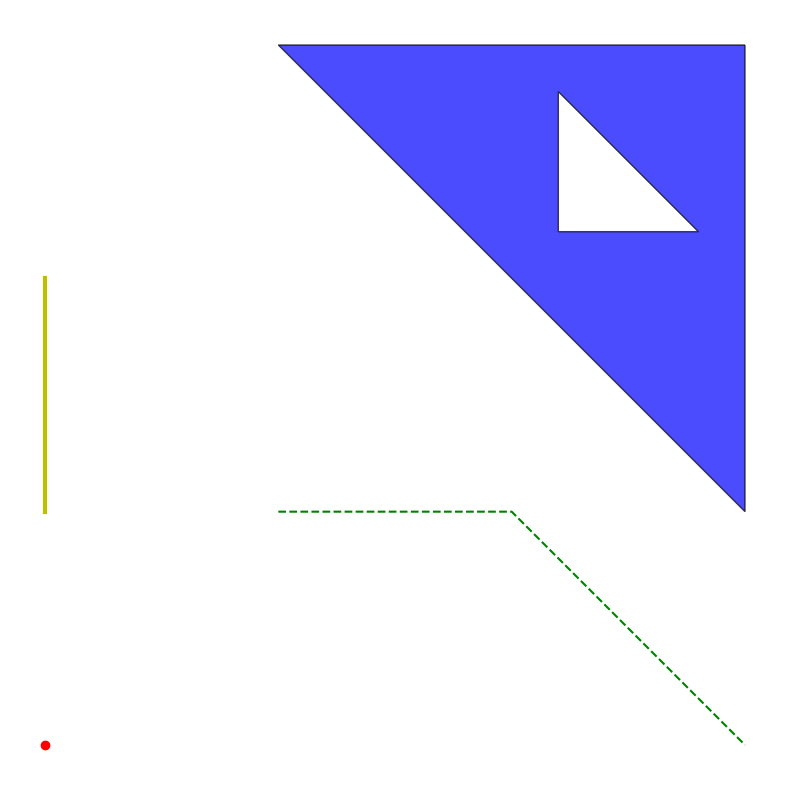

# GeomPlotter
Helps visualization of shapely's geometry objects, using matplotlib.

## Installation

    pip install git+https://github.com/hoon-volution/geom_plotter

## Example

Here's some geometric objects that we want to plot.

    from shapely import Point, LineString, Polygon
    
    point = Point(0, 0)
    linestring1 = LineString([(1, 1), (2, 1), (3, 0)])
    linestring2 = LineString([(0, 1), (0, 2)])
    polygon = Polygon([(1, 3), (3, 3), (3, 1)]) - Polygon([(2.2, 2.2), (2.8, 2.2), (2.2, 2.8)])

you can plot these objects by adding them with add_geom method. 
You can use keyword arguments used in matplotlib.

    from geom_plotter import GeomPlotter
    
    plotter = GeomPlotter()
    plotter.add_geom(point, c='r')
    plotter.add_geom(linestring1, c='g', ls='--')
    plotter.add_geom(linestring2, c='y', lw=3)
    plotter.add_geom(polygon, ec='k', fc='b', alpha=0.7)
    plotter.show()

  
